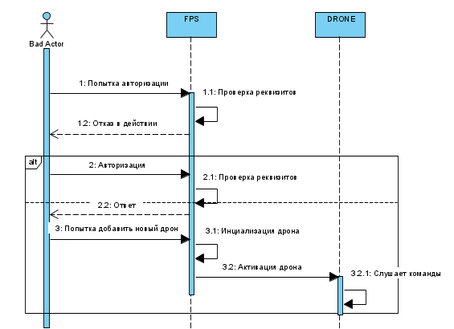
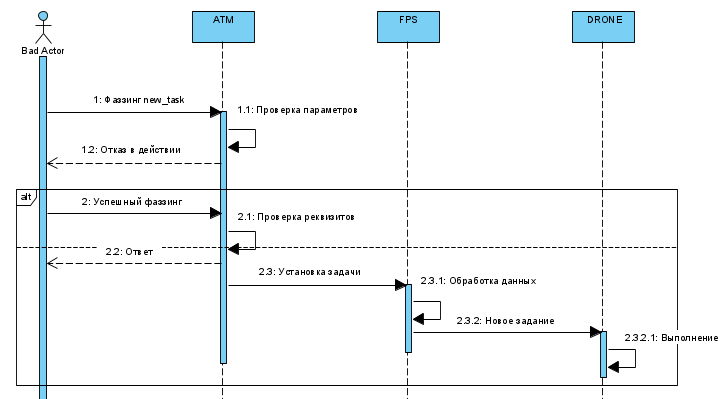

# Отчёт о прохождении хакатона cyberimmune

- [Отчёт о прохождении хакатона cyberimmune](#отчёт-о-прохождении-хакатона-cyberimmune)
  - [Постановка задачи](#постановка-задачи)
  - [Известные ограничения и вводные условия](#известные-ограничения-и-вводные-условия)
    - [Цели и Предположения Безопасности (ЦПБ)](#цели-и-предположения-безопасности-цпб)
  - [Архитектура системы](#архитектура-системы)
    - [Компоненты](#компоненты)
    - [Алгоритм работы решения](#алгоритм-работы-решения)
    - [Описание Сценариев (последовательности выполнения операций), при которых ЦБ нарушаются](#описание-сценариев-последовательности-выполнения-операций-при-которых-цб-нарушаются)
    - [Указание "доверенных компонент" на архитектурной диаграмме.](#указание-доверенных-компонент-на-архитектурной-диаграмме)
    - [Политики безопасности](#политики-безопасности)
  - [Запуск приложения и тестов](#запуск-приложения-и-тестов)
    - [Запуск приложения](#запуск-приложения)
    - [Запуск тестов](#запуск-тестов)

## Постановка задачи

В рамках хакатона необходимо было доработать предложенную архитектуру бортового обеспечения дронов-инспекторов с учётом целей безопасности:
1) декомпозировать систему и отделить критический для целей безопасности код
``` модуль fps и drone были полностью отрефакторены ```
2) в бортовом ПО нужно внедрить компонент "монитор безопасности" и реализовать контроль взаимодействия всех подсистем дрона
доработать функциональный прототип 
``` монитор внедрен в модуле fps ```
3) создать автоматизированные тесты, демонстрирующие работу механизмов защиты
``` test_security.py ```
## Известные ограничения и вводные условия
- Острая необходимость отрефакторить все 3 сущности
- Обнаружить потенциальные точки входа
- Закрыть потенциальные уязвимости слоем авторизации


### Цели и Предположения Безопасности (ЦПБ)
Цели безопасности:
1) Выполняются только аутентичные задания на мониторинг  ```(выполнено) ```
2) Выполняются только авторизованные системой ОрВД задания ```(выполнено) ```
3) Все манёвры выполняются согласно ограничениям в полётном задании (высота, полётная зона/эшелон) ```(частично выполнено) ```
4) Только авторизованные получатели имеют доступ к сохранённым данным фото-видео фиксации ```(частично выполнено) ```
5) В случае критического отказа дрон снижается со скоростью не более 1 м/с ```(не было затронуто) ```
6) Для запроса авторизации вылета к системе ОрВД используется только аутентичный идентификатор дрона ```(частично затронуто) ```
7) Только авторизованные получатели имеют доступ к оперативной информации ```(выполнено) ```


Предположения безопасности:
1) Аутентичная система ОрВД благонадёжна ```(частично выполнено) ```
2) Аутентичные сотрудники благонадёжны и обладают необходимой квалификацией ```(выполнено: добавлена регистрация) ```
3) Только авторизованные сотрудники управляют системами ```(выполнено) ```
4) Аутентичное полётное задание составлено так, что на всём маршруте дрон может совершить аварийную посадку без причинения неприемлемого ущерба заказчику и третьим лицам ```(не было затронуто) ```


## Архитектура системы

### Компоненты
- FPS (Flight Planning System, Система планирования полетов)
- Drone (Drone, Дрон)
- ATM (Air Traffic Manager, Система организации воздушного движения)

### Алгоритм работы решения
1) Пользователь регистрируется в FPS, отправляя POST запрос на *http://0.0.0.0:6065/fps_reg_user*

    | КЛЮЧ | ПРИМЕР |
    |----|----|
    | username | "JohnDoe" |
    | userpsswd | 123 |

2) Пользователь добавляет новый дрон в FPS, отправляя POST запрос на *http://0.0.0.0:6065/fps_reg_drone*

    | КЛЮЧ | ПРИМЕР |
    |----|----|
    | command | "initiate" |
    | username | "JohnDoe" |
    | userpsswd | 123 |
    | name | "ITEM1" |
    | coordinate | [0,0,0] |
    | psswd | 12345 |

3) Пользователь регистрирует дрона в ATM, отправляя POST запрос на *http://0.0.0.0:6065/set_command*

    | КЛЮЧ | ПРИМЕР |
    |----|----|
    | command | "register" |
    | username | "JohnDoe" |
    | userpsswd | 123 |
    | name | "ITEM1" |
    | psswd | 12345 |

4) Пользователь запрашивает зону полетов, отправляя POST запрос на *http://0.0.0.0:6064/set_area*

    | КЛЮЧ | ПРИМЕР |
    |----|----|
    | area | [-1,-1,100,100] |

5) Пользователь добавляет полетное задание, отправляя POST запрос на *http://0.0.0.0:6065/set_command*

    | КЛЮЧ | ПРИМЕР |
    |----|----|
    | command | "new_task"|
    | username | "JohnDoe"|
    | userpsswd| 123|
    | name | "ITEM1"|
    | points | [[5,5,5,0],[8,8,8,1],[11,11,11,1],[16,16,11,0]] |
    | psswd | 12345 |

6) Пользователь запускает полетное задание, отправляя POST запрос на *http://0.0.0.0:6065/set_command*

    | КЛЮЧ | ПРИМЕР |
    |----|----|
    | command | "start" |
    | username | "JohnDoe" |
    | userpsswd | 123 |
    | name | "ITEM1" |
    | psswd | 12345 |
    | speed | 1 |

7) Пользователь удаляет дрона из ATM, отправляя POST запрос на *http://0.0.0.0:6065/set_command*

    | КЛЮЧ | ПРИМЕР |
    |----|----|
    | command | "sign_out" |
    | username | "JohnDoe" |
    | userpsswd | 123 |
    | name | "ITEM1" |
    | psswd | 12345 |

**Дополнительно:**
1) Пользователь может получить список своих дронов, отправив POST запрос на *http://0.0.0.0:6065/fps_get_drones*
2) Пользователь может остановить выполнение полетного задания, отправив POST запрос на *http://0.0.0.0:6065/set_command*

### Описание Сценариев (последовательности выполнения операций), при которых ЦБ нарушаются
1) Брутфорс аккаунта оператора в сервисе FPS приводит к возможности выполнения команд зарегистрированных дронов
2) Отсутствие надежной защиты в системе ATM может привести к инъекции вредоносных данных, например функция new_task может спокойно направить дрона на абордаж какого-нибудь объекта (конечно если поменять зону полета)


**Диаграмма № 1: Брутфорс аккаунта оператора**



**Диаграмма № 2: Bad Actor успешно фаззит эндпоинты ATM**



### Указание "доверенных компонент" на архитектурной диаграмме.
| Название | Уровень доверия | Обоснование | Рефактор? |
|----|----|----|----|
|*FPS (Flight Planning System, Система планирования полетов)* | Высокий | Данный компонент обрабатывает команды от пользователей и дронов. Этот компонент имеет высокий уровень доверия по нескольким причинам: Безопасность аутентификации и авторизации: Компонент использует модуль fps_sec, который предоставляет функции для проверки учетных данных пользователей и дронов. Это обеспечивает, что только аутентифицированные и авторизованные пользователи и дроны могут взаимодействовать с сервером. Это важно для обеспечения безопасности системы, так как оно предотвращает несанкционированный доступ к серверу. Управление ошибками: Компонент обрабатывает ошибки, связанные с неверными учетными данными или отсутствием дронов. Это помогает предотвратить неожиданные сбои в работе сервера и обеспечивает более стабильную работу системы. Обработка команд: Компонент обрабатывает различные команды, такие как "start", "stop", "sign_out", "new_task", "register", "clear_flag". Это позволяет ему эффективно управлять дронами и обеспечивает гибкость в использовании системы. Безопасность данных: Компонент обрабатывает данные от дронов и пользователей, что требует обеспечения безопасности этих данных. Он использует заголовки контента для указания типа данных и предотвращения возможных атак, таких как межсайтовый скриптинг (XSS) или межсайтовые подделки запросов (CSRF). Этот компонент обеспечивает высокий уровень доверия, поскольку он обеспечивает безопасность, аутентификацию, авторизацию, обработку ошибок и безопасность данных.  | Был отрефакторен | 
|*Drone (DroneApp, Дрон)* | Средний |  Этот компонент имеет средний уровень доверия по нескольким причинам: Аутентификация и авторизация: В коде отсутствует явная реализация механизмов аутентификации и авторизации. Это может привести к несанкционированному доступу к серверу. Для улучшения уровня доверия, можно внедрить систему аутентификации и авторизации, которая будет проверять учетные данные пользователей и дронов перед обработкой их команд. Обработка ошибок: В коде отсутствует явная обработка ошибок. Это может привести к непредвиденным сбоям в работе сервера. Для улучшения уровня доверия, можно внедрить механизмы обработки ошибок, которые будут корректно обрабатывать ошибки и предотвращать их проникновение в систему. Безопасность данных: В коде отсутствует явная защита данных. Это может привести к утечке конфиденциальной информации. Для улучшения уровня доверия, можно внедрить механизмы защиты данных, которые будут обеспечивать безопасность обрабатываемых данных. | Был отрефакторен | 
|*ATM (Air Traffic Manager, Система организации воздушного движения)* | Низкий | Этот компонент имеет низкий уровень доверия по нескольким причинам: Аутентификация и авторизация: В коде отсутствует явная реализация механизмов аутентификации и авторизации. Это может привести к несанкционированному доступу к серверу. Например, в методе sign_up дрон получает токен, который используется для аутентификации. Однако, этот токен генерируется случайным образом, что может привести к утечке токенов и их переиспользованию. Обработка ошибок: В коде отсутствует явная обработка ошибок. Это может привести к непредвиденным сбоям в работе сервера. Например, в методе data_in ошибки при обработке запроса просто игнорируются и возвращается сообщение об ошибке, что может привести к некорректной работе сервера. Безопасность данных: В коде отсутствует явная защита данных. Это может привести к утечке конфиденциальной информации. Например, в методе sign_up токен дрона сохраняется в открытом виде, что может привести к его утечке. | Не был затронут | 


## Запуск приложения и тестов

### Запуск приложения

```make prepare ```
```make rebuild ```
```make run ```

### Запуск тестов

```make logs ```
```make test ```
```make test-sec ```
